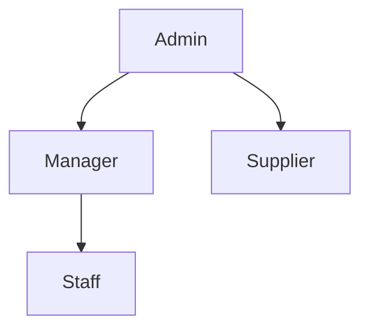
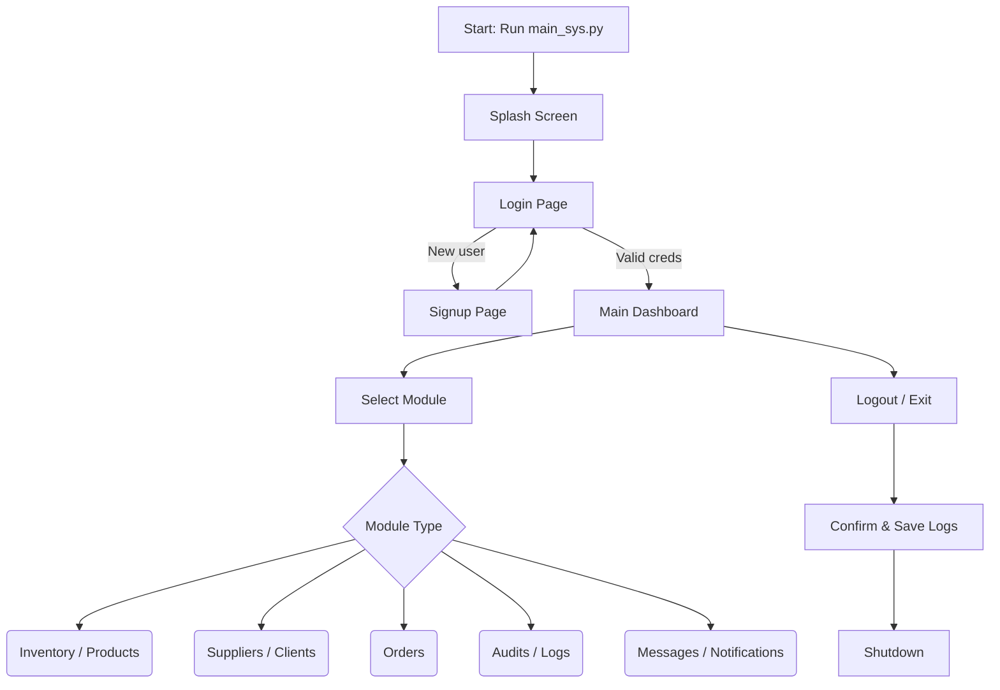

# NovusMRP System Flow

This document describes the high-level workflow of the NovusMRP application,
from user authentication through navigation of the main modules.  It can be
used as a reference for developers or end‑users who want to understand how the
system behaves.

## 1. Launching the Application

1. User executes `python main_sys.py` from the project root.
2. The `NovusApp` class is instantiated, which:
   - Creates a splash screen (`SplashScreen`) and hides the main window.
   - Initializes a `DatabaseManager` object with an empty session.
   - Sets up the main UI container and prepares for frame loading.
   - Begins loading the login frame immediately and spawns a background thread
     (`_load_other_frames`) to construct the remaining pages.

3. Once initialization completes, the splash screen disappears, and the login
   page is shown.

## 2. Authentication Flow

### 2.1 Signup

- User clicks the "Create account" or similar button on the login page.
- The `SignupPage` frame is displayed, presenting fields for personal data,
  email/username, and password.
- Upon form submission, the signup logic (in `global_func` via the
  `DatabaseManager` or the page itself) validates the input, hashes the
  password, and inserts a new user row into the SQLite database.
- If successful, the user is typically redirected back to the login page with a
  success message.

### 2.2 Login

- On the `LoginPage`, the user enters credentials (username/email and password).
- The input is validated against stored hashed passwords in the database.
- Upon successful authentication, the `login()` method of `NovusApp` is called
  with the user’s data.
- `NovusApp.login()` populates the `session` dictionary with details (user id,
  names, email, phone, username, and hashed password) and shows a
  `LoginSuccessMessageBox`.
- After login, the main MRP dashboard (frame `MainMRP` or similar) becomes
  active.

## 3. Session & Navigation

- The `session` dictionary stays in memory throughout the app, allowing
  different frames to read user information and permissions.
- `NovusApp` maintains a `frames` dictionary mapping `FrameNames` to
  instantiated page objects.
- `show_frame(page_name)` raises the requested frame and, if the frame defines
  an `on_show()` method, calls it to refresh or load data.

### Common Frame Lifecycle

1. Frame is instantiated by `_load_other_frames()` when the app initializes.
2. It is placed in the container grid and stored in `self.frames`.
3. When navigated to, the `show_frame` method displays it and executes any
   associated refresh logic.
4. Frames may implement `load_data()`, `refresh()`, or `refresh_dashboard()` to
   update their contents from the database; `NovusApp.refresh_all_frames()` can
   drive these updates globally.

## 4. Core Module Workflows

(Each module follows a similar CRUD pattern)

### 4.1 Inventory / Products / Suppliers / Clients

- User navigates to the desired module via menu buttons.
- The corresponding page class (e.g., `InventoryPage`) presents a table or
  list of current records.
- Add/Edit/Delete operations open modal dialogs or separate frames to collect
  input; the page forwards requests to the `DatabaseManager` CRUD methods.
- After modification, the page refreshes its display to show updated data.

### 4.2 Orders

- Create new production or purchase orders by selecting products/clients and
  quantities.
- The order page interacts with the database to update stock levels and log
  transactions.
- Active orders can be viewed/edited until they are completed or cancelled.

### 4.3 Audit Logging

- Every significant user action (login, logout, CRUD operations) writes an
  entry to the `user_logs` table in `main.db`.
- Logout events are also appended to a separate log file `log_f/login.log`.
- The `AuditsPage` displays these records to administrators.

## 5. Logout & Shutdown

- When the user chooses to quit (window close or logout button),
  `_on_app_close()` is triggered.
- A confirmation dialog appears. If confirmed:
  - The logout is written to both the SQLite `user_logs` table and the
    external log file with timestamp and user info.
  - Database connection is closed and the main window is destroyed.
  - The program exits gracefully.

## 6. Background Tasks & Utilities

- Splash screen progress updates occur on the loading thread during startup.
- Long‑running operations (e.g. sending emails via `mails.py`) may spawn
  separate threads to keep the GUI responsive.
- Utility functions in `global_func.py` (such as `center_window` and
  `resource_path`) assist with consistent behavior across platforms and when
  packaged with PyInstaller.

## 7. Database Schema / ERD

The application stores its data in a single SQLite database (`main.db`). The
schema is defined in `update_db.py` and consists of the following major
entities and relationships:

```
clients            users             suppliers
   │                 │                  │
   │             user_logs             raw_mats
   │              ▲  │                 ▲ │
   │              │  └────┐            │ │
   │              │       │            │ │
   │       messages◄──┐   │            │ │
   │        (sender/  │   │            │ │
   │         receiver)│   │            │ │
   │                   │   │            │ │
   │                   │   │            │ │
   ▼                   ▼   │            │ ▼
 orders ──▶ order_history │            │
   │          ▲           │            │
   │          │           │            │
   ▼          │           ▼            │
 production_schedule      └─────────▶ material_volumes
                                ╷
                                └──▶ unit_of_measures

notifications (user_id -> users)
```

### Key relationships

- **orders** reference a `product_id` (→ products table) and a `client_id`.
  - Each order may have a history entry (`order_history`) and exactly one
    production schedule (`production_schedule`).
- **products** are standalone records that describe manufactured items; they
  are not directly connected to raw materials but orders for products drive the
  MRP logic.
- **clients** and **suppliers** hold contact information.  Suppliers are linked
  from `raw_mats.supplier_id` and clients from `orders.client_id`.
- **raw_mats** describes inventory of materials; each material has a unit and a
  volume that reference the `unit_of_measures` and `material_volumes` tables.
- **users** are the system accounts.  Many tables reference `user_id`:
  - `user_logs` records actions by users.
  - `messages` link sender and receiver to users; attachments cascade on
    message deletion.
  - `notifications` are directed at a single user.
- **user_logs** and **notifications** help audit and alert within the system.

The schema uses foreign‑key constraints with ON DELETE/UPDATE rules to maintain
integrity.  Refer to `update_db.py` for the full DDL if precise column
definitions are needed.

## 8. User Roles & Hierarchy

Access in NovusMRP is governed by a simple hierarchy of user types stored in
the `usertype` column of the `users` table.  The allowed values are defined in
the database schema as:

```sql
CHECK(usertype IN ('admin', 'manager', 'staff', 'supplier'))
```

- **admin** – unlimited permissions; can manage users, view and edit all data,
  configure system settings.
- **manager** – oversees operations, processes orders, and generates reports.
- **staff** – performs routine data entry such as updating inventory and
  creating client records.
- **supplier** – external users who can view orders relevant to them and
  update material shipments.

The main application checks `self.session['usertype']` when deciding which
frames or controls to enable; for example, only admins see the user management
pages and audit logs.



## 9. Diagram Summary

Below are handy visualizations that accompany the textual flow described above.

### Navigation Flow



### Component/Data Flow

```mermaid
flowchart LR
    UI[User Interface] -->|user actions| Controller[Application Controller]
    Controller -->|queries/updates| DB[(SQLite DB)]
    DB -->|returns data| Controller
    Controller -->|render updates| UI
    Controller -->|log events| Logs[Log files / user_logs]
    UI -->|notifications| Controller
    Controller -->|send messages| Mail[Email/SMS (mails.py)]
```

---

This system flow document can be expanded as the application grows; modules can
be added or refined with more detailed sequence diagrams or state charts if
needed.